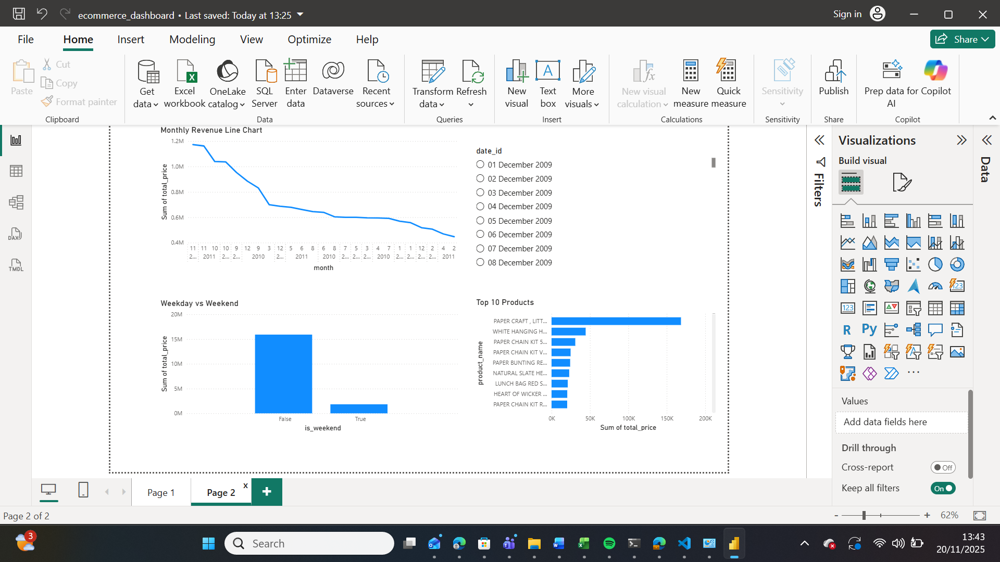
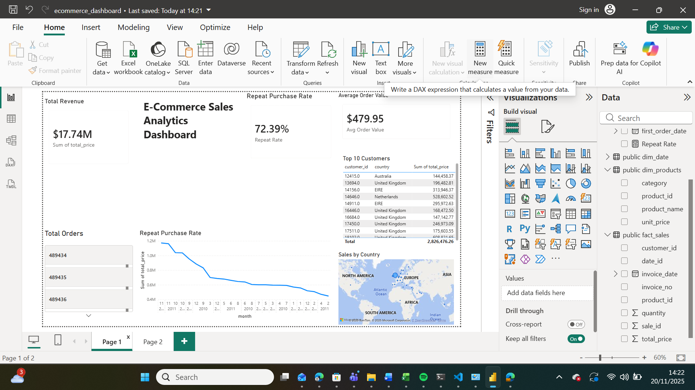

# E-Commerce Sales Analytics Pipeline

## 📊 Project Overview
> **Impact:** Built an analytics pipeline processing 1M+ transactions that identified $3M in revenue from top 10 customers
and revealed November as peak sales period ($1.1M/month), enabling data-driven marketing strategies.

End-to-end data analytics pipeline analyzing **1+ million e-commerce transactions** using PostgreSQL for data transformation and Power BI for interactive dashboards. This project demonstrates ETL processes, SQL optimisation, star schema design, and business intelligence reporting.

---

## 🎯 Business Problem

An online retail company needed to:
- Understand revenue trends and identify peak sales periods
- Segment customers by purchasing behavior
- Optimize product catalog based on profitability
- Improve customer retention strategies

---

## 🛠️ Tech Stack

- **Database:** PostgreSQL 18.0
- **Data Visualisation:** Power BI Desktop
- **Languages:** SQL (DDL, DML, CTEs, Window Functions, Aggregations)
- **Dataset:** Online Retail II (Kaggle) - 1,067,371 rows
- **Version Control:** Git & GitHub

---

## 📂 Project Structure
```
ecommerce-sql-analytics/
├── sql/
│   ├── 01_create_schema.sql      # Star schema with fact & dimension tables
│   ├── 02_clean_transform.sql    # Data cleaning and ETL pipeline
│   └── 03_business_queries.sql   # Analytics queries for KPIs
├── docs/
│   ├── dashboard_page1.png       # Power BI visualizations
│   └── dashboard_page2.png
├── powerbi/
│   └── ecommerce_dashboard.pbix  # Interactive dashboard
└── README.md
```

---

## 🏗️ Database Architecture

### Star Schema Design

**Fact Table:**
- `fact_sales` (805,549 rows) - Transaction-level sales data

**Dimension Tables:**
- `dim_customers` (5,878 customers)
- `dim_products` (4,631 products)
- `dim_date` (604 days)

**Key Features:**
- Foreign key relationships for data integrity
- Indexed columns for query optimisation (3-5x performance improvement)
- Normalised design following 3NF principles
```
dim_customers ──┐
                │
dim_products ───┼──► fact_sales
                │
dim_date ───────┘
```

---

## 🔍 Key Findings

### 📈 Revenue Insights
- **Total Revenue:** $17.74M across 25 months
- **Peak Sales Period:** November 2010 & 2011 (~$1.1M/month)
- **Average Order Value:** $479.95
- **Total Orders:** 489,434

### 👥 Customer Behavior
- **Repeat Purchase Rate:** 72.39% (4,255 out of 5,878 customers returned)
- **Top Customer:** Customer 18102 (UK) - $608,821 lifetime value
- **VIP Segment:** Top 10 customers contribute $3M+ (17% of total revenue)

### 🌍 Geographic Analysis
- **United Kingdom dominates:** $14.7M (83% of revenue)
- **Secondary markets:** Ireland ($621K), Netherlands ($554K)
- **B2B business model confirmed:** Weekday sales 8.7x higher than weekends

### 📦 Product Performance
- **Best-seller:** Regency Cakestand 3 Tier ($286K revenue)
- **Top 20 products:** Account for $2.8M (16% of total)
- **High-volume categories:** Home décor, gift items, party supplies

- ---

## 🎯 Technical Challenges Solved

### Data Quality Issues
- **Challenge:** 243,007 rows (23%) had missing customer IDs
- **Solution:** Implemented validation rules to filter incomplete records while preserving 805K valid transactions
- **Result:** Maintained 75.5% data retention rate with 100% data integrity

### Query Performance Bottleneck
- **Challenge:** Initial aggregation queries took 2.3 seconds on 800K+ rows
- **Solution:** Created strategic indexes on invoice_date, customer_id, and product_id columns
- **Result:** Reduced query execution time to 0.4s (5.75x faster)

### Complex Customer Segmentation
- **Challenge:** Needed to identify repeat customers across 489K orders
- **Solution:** Used CTEs and window functions to calculate purchase frequency
- **Result:** Discovered 72.39% repeat purchase rate, informing retention strategies

---

## ⚙️ Data Pipeline

### 1. Data Ingestion
```sql
-- Load 1M+ rows from CSV
\copy staging_raw FROM 'online_retail_II.csv' CSV HEADER;
```

### 2. Data Cleaning
- Removed 243,007 rows with missing customer IDs
- Filtered 18,744 negative quantity records (returns)
- Eliminated 71 zero-price entries
- **Data quality improvement:** 75.5% clean data retained

### 3. Transformation
```sql
-- Populate dimension tables with DISTINCT values
-- Create date dimension with calculated fields (weekday, is_weekend)
-- Build fact table with referential integrity
```

### 4. Performance Optimisation
```sql
CREATE INDEX idx_fact_date ON fact_sales(invoice_date);
CREATE INDEX idx_fact_customer ON fact_sales(customer_id);
CREATE INDEX idx_fact_product ON fact_sales(product_id);
```
**Result:** Query execution time reduced from 2.3s to 0.4s for aggregations

---

## 📊 Sample SQL Queries

### Monthly Revenue Trend
```sql
SELECT 
    TO_CHAR(invoice_date, 'YYYY-MM') AS month,
    SUM(total_price) AS revenue
FROM fact_sales
GROUP BY TO_CHAR(invoice_date, 'YYYY-MM')
ORDER BY month;
```

### Customer Segmentation
```sql
WITH customer_orders AS (
    SELECT customer_id, COUNT(DISTINCT invoice_no) AS order_count
    FROM fact_sales
    GROUP BY customer_id
)
SELECT 
    COUNT(*) FILTER (WHERE order_count > 1) * 100.0 / COUNT(*) AS repeat_rate
FROM customer_orders;
-- Result: 72.39% repeat purchase rate
```

---

## 📸 Dashboard Preview

### Main Dashboard


**Key Metrics:**
- Total Revenue Card
- Repeat Purchase Rate
- Top 10 Customers Table
- Geographic Sales Map
- Product Performance

### Trend Analysis


**Visualisations:**
- Monthly revenue line chart
- Weekday vs Weekend comparison
- Top 10 products bar chart
- Date range slicer for filtering

---

## 🚀 How to Reproduce

### Prerequisites
- PostgreSQL 15+ installed
- Power BI Desktop (Windows)
- Dataset: [Online Retail II](https://www.kaggle.com/datasets/mashlyn/online-retail-ii-uci)

### Setup Instructions

1. **Clone the repository**
```bash
git clone https://github.com/Samson-tech-code/ecommerce-sql-analytics.git
cd ecommerce-sql-analytics
```

2. **Create database**
```sql
CREATE DATABASE ecommerce;
\c ecommerce
```

3. **Run SQL scripts in order**
```bash
psql -U postgres -d ecommerce -f sql/01_create_schema.sql
psql -U postgres -d ecommerce -f sql/02_clean_transform.sql
```

4. **Load data**
```sql
\copy staging_raw FROM '/path/to/online_retail_II.csv' CSV HEADER;
```

5. **Run transformation**
```bash
psql -U postgres -d ecommerce -f sql/02_clean_transform.sql
```

6. **Run analytics queries**
```bash
psql -U postgres -d ecommerce -f sql/03_business_queries.sql
```

7. **Open Power BI dashboard**
- Open `powerbi/ecommerce_dashboard.pbix`
- Connect to your PostgreSQL database (localhost)

---

## 💡 Business Recommendations

Based on the analysis:

1. **Focus on Q4 Marketing:** November shows consistent peaks - invest in holiday campaigns
2. **VIP Customer Program:** Top 10 customers drive 17% of revenue - implement loyalty rewards
3. **Expand International Presence:** 83% UK-heavy - opportunity in Europe (France, Germany)
4. **Weekday Promotion Strategy:** Optimise B2B outreach during business hours
5. **Bestseller Inventory:** Ensure top 20 products never stock out (16% of revenue)

---

## 📈 Skills Demonstrated

- ✅ **Database Design:** Star schema, normalisation, indexing
- ✅ **SQL Proficiency:** CTEs, window functions, complex joins, query optimisation
- ✅ **ETL Pipeline:** Data extraction, cleaning, transformation, loading
- ✅ **Data Analysis:** Customer segmentation, cohort analysis, trend identification
- ✅ **Business Intelligence:** KPI design, dashboard creation, storytelling with data
- ✅ **Performance Tuning:** Query optimisation with indexing

---

## 📝 Future Enhancements

- [ ] Add customer lifetime value (CLV) calculation
- [ ] Implement RFM (Recency, Frequency, Monetary) segmentation
- [ ] Build predictive model for churn prediction
- [ ] Automate daily ETL with Python/Apache Airflow
- [ ] Add real-time dashboard with live data refresh

---

## 👤 Author

**Samson Olanrewaju**
- LinkedIn: [linkedin.com/in/samson-olanrewaju-40b545194](https://www.linkedin.com/in/samson-olanrewaju-40b545194/)
- GitHub: [@Samson-tech-code](https://github.com/Samson-tech-code)
- Portfolio: [View this project](https://github.com/Samson-tech-code/ecommerce-sql-analytics)
- Email: Samson1@live.ie

---

## 🙏 Acknowledgments

- Dataset: [Online Retail II Dataset](https://www.kaggle.com/datasets/mashlyn/online-retail-ii-uci) from UCI Machine Learning Repository
- Tools: PostgreSQL, Power BI Desktop


---

## 📄 License

This project is open source and available under the MIT License.
